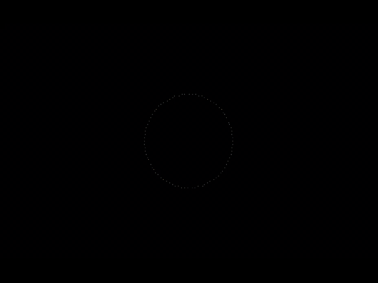
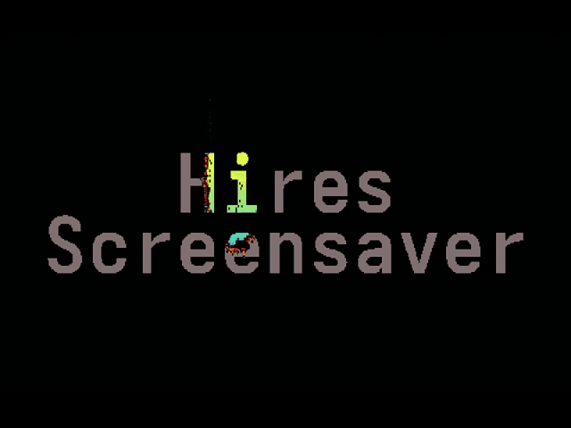

# Omarchy Adwaita hires screensaver · v0.3.1

<p align="center">
  
  
</p>

High-resolution `█▄▀` mosaic screensaver for [Omarchy](https://omarchy.org), drawn from **Adwaita Mono**.  
Économiseur d’écran mosaïque haute résolution pour Omarchy, tracé en **Adwaita Mono**.

---

## English

Omarchy’s screensaver is genuinely magnificent, but:

- Its resolution is ridiculous
- The original font is just ugly. Original, sure — but let’s say it: ugly.
- The text deserves to be editable.

This module addresses those three points. It does **not** ship any personal branding. You supply the words; it rasterizes them into a dense block mosaic and plays them with `ttfx` on the real fullscreen grid (not the 80×24 pty that the stock launcher often captures).

### Release notes — v0.3.1

- Corrects a wrong claim in the v0.2.3 notes: panel IPC was never broken. `omarchy-shell rafale83.hires-screensaver open|close|show|hide|toggle` works. On a multi-monitor setup the panel opens on the bar's monitor, which is not necessarily the focused one.

### Release notes — v0.3.0

- **Choose the font.** The panel lists the installed monospace families and takes any other family typed in. Cairo's toy font API substitutes silently when a family is missing, so the generator asks fontconfig first and says what it fell back to.
- **Fortune cookies.** A new artwork source, in English, French, Spanish, German and Mandarin. A fresh quote is drawn before every effect cycle, not just at launch.
- Quotes come from short bundled corpora written for the mosaic, blended with the system `fortune` when a database exists for that language. `~/.local/share/fortune/<lang>` is searched as well — `fortune` itself does not look there, but language packs are often unpacked into it.
- System quotes are cleaned up before rasterizing: terminal colour codes stripped, `-- Source` and `-+- Source -+-` attributions dropped, and CJK wrapped by character since it has no spaces to wrap on.
- Mandarin without CJK glyphs in the chosen font falls back to Noto Sans CJK automatically.
- `omarchy-adwaita-screensaver-fortunes fr es zh` fetches the large Debian corpora into `~/.local/share/fortune/`. Opt-in and separate: `install.sh` never calls it, it needs no root, and the plugin works fully without it.
- **Size control.** A `Size (mosaic columns)` field scales the artwork: the width in terminal cells, with the height following. 400 is the default and fills most of the screen; lower is smaller. Applies to text and fortunes.
- `Model.js` no longer declares `.pragma library`. Quickshell evaluates such a script once per engine and does not re-evaluate it on a plugin hot reload, so the panel kept showing the previous `Source` list while the new file already sat on disk. The file holds only constants and pure functions, so a copy per importer costs nothing.
- Fixed `omarchy-notification-send -g "Hires screensaver updated"`: `-g` takes a glyph, so the headline was consumed as one and the usage text printed on every apply.

### Release notes — v0.2.3

- The panel shows the installed version and checks GitHub for a newer one when it opens. When one exists, an **Update to vX.Y.Z** button runs `omarchy plugin update` followed by `install.sh`.
- The result is judged on the `VERSION` file after the pull, not on the exit code: `omarchy plugin update` can succeed without pulling anything (already current, or local changes in the plugin folder), and the panel now says so instead of claiming a successful update.
- `install.sh` now also copies `VERSION` into the plugin folder. Installing from a working copy left it out, so the panel had no version to read.
- `install.sh` waits a second before `rescanPlugins`. Two reload paths landing together can race quickshell's engine teardown and segfault it in `IpcHandler` registration.

### Release notes — v0.2.2

- Fixed `install.sh` aborting when run from the installed plugin folder — the route the README documents after `omarchy plugin add`. `ROOT` and `PLUGIN_DST` were the same directory, `install` refused to copy each file onto itself, and `set -e` killed the script before it wrote the `PATH` blocks to `~/.bashrc` and `~/.config/hypr/hyprland.lua`. The overlay landed but the screensaver never started on idle.
- The final line reports the version from `VERSION` instead of a hardcoded string.

### Release notes — v0.2.1

- Removed the `~/.local/bin/foot` shim. It shadowed the real terminal on `PATH`, overwrote a pre-existing user wrapper on install, and deleted that path unconditionally on uninstall. Nothing needed it: `omarchy-launch-screensaver` calls `run-foot.sh` directly, and `run-foot.sh` execs `/usr/bin/foot` by absolute path.
- Upgrading from v0.2 removes the leftover shim, but only when it is byte-for-byte the wrapper this project shipped. A foreign file or a symlink at that path is left alone.

### Release notes — v0.2

- Bar widget: text, AI logo, photo, Omarchy idle / lock delays, exclude ugly effects
- Settings apply immediately (no shell restart)
- **Fullscreen** preview via the local launcher (no more 80×24 postage stamp)
- Logos are **marks only**, no wordmarks. Grok without the “Grok” letters. DeepSeek is the whale. Also: OpenAI, Claude, Gemini, Kimi, GLM, Qwen, Mistral, Llama
- Photos become **truecolor** ASCII (24-bit half-blocks), not a two-tone silhouette. Phone JPEGs: EXIF, 25 MB cap, auto-downscale
- Idle delays are written to `shell.json` and confirmed by the Omarchy idle service, without reconverting the photo
- No user photos or personal branding are published

### What it does

- Runs the screensaver in Foot at **8px cells** (~480×141 on a 3840×2400 @ 1.6 display)
- Waits until the terminal has actually resized, then sizes the `ttfx` canvas to match
- Rasterizes your message with Adwaita Mono Bold into half-block characters
- Intercepts the packaged Foot screensaver config (which hardcodes JetBrains Mono)
- Default animation rate: 260 fps (`SS_FRAME_RATE` overrides)
- Bar widget: text, AI logo, photo, Omarchy idle/lock delays, exclude ugly effects

Locking stays Omarchy's lock screen (password, fingerprint, FIDO2 — whatever you already set up). The panel only edits `idle.screensaver` and `idle.lock`.

Photos (including phone JPEGs) are gated: 25 MB cap, EXIF orientation, auto-downscale, truecolor half-block mosaic. Bundled SVG logos are [Lobe Icons](https://github.com/lobehub/lobe-icons) marks (MIT).

### Requirements

- Omarchy (Hyprland + Foot + `ttfx`)
- Adwaita Mono (ships with Omarchy)
- `python-cairo`
- ImageMagick (`magick`) for logos and photos

### Install

```bash
omarchy plugin add https://github.com/Rafale83/omarchy-adwaita-screensaver.git --enable
~/.config/omarchy/plugins/rafale83.hires-screensaver/install.sh
```

`omarchy plugin add` installs the bar widget. `install.sh` installs the high-res Foot/`ttfx` overlay (wrappers on `PATH`, logos, photo converter). Both steps are required.

Or clone and install from a working copy:

```bash
git clone https://github.com/Rafale83/omarchy-adwaita-screensaver.git
cd omarchy-adwaita-screensaver
./install.sh
```

The **Hires screensaver** widget lands on the right of the bar. Click it to open the panel.

Or generate a mosaic from the CLI:

```bash
omarchy-adwaita-screensaver-generate hello
# or several lines:
omarchy-adwaita-screensaver-generate 'line one' 'line two'
```

Or write `~/.config/omarchy/branding/screensaver-message` and run the generator with no arguments.

Preview:

```bash
omarchy-launch-screensaver force
```

A key or mouse movement dismisses it. Idle still launches it through Omarchy.

### Optional: more fortunes

Fortune cookies work out of the box — the plugin ships short quotes in English,
French, Spanish, German and Mandarin, and needs nothing installed. If the system
`fortune` command is present with a database for the chosen language, quotes are
drawn from both.

Debian used to package large French, Spanish and Chinese corpora. They were
dropped after Debian 11 and have no Arch equivalent, so this fetches them from
the Debian archive on request:

```bash
omarchy-adwaita-screensaver-fortunes fr es zh
omarchy-adwaita-screensaver-fortunes --list
```

It writes only under `~/.local/share/fortune/<lang>/`, needs no root and refuses
to run as it, and `install.sh` never calls it. Nothing else in the plugin
touches the network.

### Uninstall

```bash
~/.config/omarchy/plugins/rafale83.hires-screensaver/uninstall.sh
# or, from a clone:
./uninstall.sh
```

That removes the wrappers, overlay, and bar widget (`omarchy plugin remove rafale83.hires-screensaver`). It leaves `~/.config/omarchy/branding/screensaver.txt` alone.

### Layout

```
install.sh
uninstall.sh
VERSION
bin/omarchy-launch-screensaver
bin/omarchy-screensaver               wait for fullscreen grid, then ttfx
bin/omarchy-adwaita-screensaver-generate
bin/omarchy-adwaita-screensaver-fortunes   optional Debian corpora fetcher
overlay/pick-fortune.py
overlay/fortunes/*.json
BarWidget.qml / Panel.qml / Model.js / manifest.json
overlay/generate-branding.py
overlay/convert-image.py
overlay/apply-settings.py
overlay/logos/*.svg
overlay/run-foot.sh
overlay/fonts.conf
overlay/default/foot/screensaver.ini
```

### License

MIT

---

## Français

L’économiseur d’écran d’Omarchy est juste magnifique mais :

- Sa résolution est ridicule
- La police d’origine est juste moche. Originale, certes, mais, disons-le, moche.
- Le texte mériterait d’être modifiable.

Ce module s’attaque à ces trois points. Il **n’embarque aucune charte personnelle** : tu fournis les mots ; il les rasterise en mosaïque dense de blocs et les joue avec `ttfx` sur la vraie grille plein écran (pas le pty 80×24 que le lanceur d’origine capture trop souvent).

### Notes de version — v0.3.1

- Corrige une affirmation fausse des notes v0.2.3 : l'IPC du panneau n'a jamais été cassé. `omarchy-shell rafale83.hires-screensaver open|close|show|hide|toggle` fonctionne. En multi-écran, le panneau s'ouvre sur le moniteur de la barre, qui n'est pas forcément celui qui a le focus.

### Notes de version — v0.3.0

- **Choix de la police.** Le panneau liste les familles monospace installées et accepte n'importe quelle autre famille saisie à la main. L'API « toy » de cairo substitue silencieusement quand une famille manque, donc le générateur interroge fontconfig d'abord et annonce son repli.
- **Fortune cookies.** Nouvelle source d'illustration, en anglais, français, espagnol, allemand et mandarin. Une nouvelle citation est tirée avant chaque cycle d'effet, pas seulement au lancement.
- Les citations viennent de corpus courts embarqués, écrits pour la contrainte de la mosaïque, mélangés au `fortune` système quand une base existe pour la langue. `~/.local/share/fortune/<langue>` est également exploré — `fortune` n'y regarde pas, mais c'est là qu'on décompresse souvent les paquets de langue.
- Les citations système sont nettoyées avant rastérisation : codes couleur du terminal retirés, attributions `-- Source` et `-+- Source -+-` supprimées, et découpage du CJK caractère par caractère, faute d'espaces où couper.
- Le mandarin avec une police dépourvue de glyphes CJK bascule automatiquement sur Noto Sans CJK.
- `omarchy-adwaita-screensaver-fortunes fr es zh` récupère les gros corpus Debian dans `~/.local/share/fortune/`. Opt-in et séparé : `install.sh` ne l'appelle jamais, aucun droit root, et le module fonctionne pleinement sans lui.
- **Réglage de taille.** Un champ `Size (mosaic columns)` met l'illustration à l'échelle : la largeur en cellules du terminal, la hauteur suivant. 400 est le défaut et remplit presque l'écran ; plus bas est plus petit. S'applique au texte et aux fortunes.
- `Model.js` ne déclare plus `.pragma library`. Quickshell évalue un tel script une seule fois par moteur et ne le réévalue pas au rechargement à chaud d'un plugin : le panneau continuait d'afficher l'ancienne liste `Source` alors que le nouveau fichier était déjà sur disque. Le fichier ne contient que des constantes et des fonctions pures, une copie par importateur ne coûte rien.
- Correction de `omarchy-notification-send -g "Hires screensaver updated"` : `-g` attend un glyphe, le titre était donc avalé comme tel et l'aide s'affichait à chaque application.

### Notes de version — v0.2.3

- Le panneau affiche la version installée et interroge GitHub à l'ouverture. Si une version plus récente existe, un bouton **Update to vX.Y.Z** enchaîne `omarchy plugin update` puis `install.sh`.
- Le verdict se lit dans le fichier `VERSION` après le pull, pas dans le code de sortie : `omarchy plugin update` peut réussir sans rien tirer (déjà à jour, ou modifications locales dans le dossier du plugin), et le panneau le dit désormais au lieu d'annoncer une mise à jour qui n'a pas eu lieu.
- `install.sh` copie désormais aussi `VERSION` dans le dossier du plugin. Une installation depuis une copie de travail l'omettait, et le panneau n'avait alors aucune version à lire.
- `install.sh` attend une seconde avant `rescanPlugins`. Deux chemins de rechargement simultanés peuvent entrer en course avec l'arrêt du moteur quickshell et le faire segfauler dans l'enregistrement d'un `IpcHandler`.

### Notes de version — v0.2.2

- Correction de `install.sh` qui s'interrompait quand on le lançait depuis le dossier du plugin installé — la route documentée dans le README après `omarchy plugin add`. `ROOT` et `PLUGIN_DST` désignaient le même répertoire, `install` refusait de copier chaque fichier sur lui-même, et `set -e` tuait le script avant l'écriture des blocs `PATH` dans `~/.bashrc` et `~/.config/hypr/hyprland.lua`. L'overlay était posé mais le screensaver ne démarrait jamais à l'inactivité.
- La dernière ligne affiche la version lue dans `VERSION` au lieu d'une chaîne codée en dur.

### Notes de version — v0.2.1

- Suppression du shim `~/.local/bin/foot`. Il masquait le vrai terminal dans le `PATH`, écrasait un wrapper utilisateur préexistant à l'installation et supprimait ce chemin sans condition à la désinstallation. Rien n'en dépendait : `omarchy-launch-screensaver` appelle `run-foot.sh` directement, et `run-foot.sh` exécute `/usr/bin/foot` en chemin absolu.
- La mise à jour depuis la v0.2 retire le shim résiduel, uniquement s'il correspond exactement au wrapper livré par ce projet. Un fichier étranger ou un lien symbolique à cet emplacement n'est pas touché.

### Notes de version — v0.2

- Widget barre : texte, logo IA, photo, délais d’inactivité / verrouillage Omarchy, exclusion d’effets moches
- Les réglages s’appliquent tout de suite (plus besoin de relancer le shell)
- Aperçu **plein écran** via le lanceur local (fini le timbre-poste 80×24)
- Logos = **marque seule**, pas de wordmark. Grok sans le texte « Grok ». DeepSeek = baleine. Aussi : OpenAI, Claude, Gemini, Kimi, GLM, Qwen, Mistral, Llama
- Photos en ASCII **truecolor** (demi-blocs 24 bits), plus une silhouette deux couleurs. JPEG de téléphone : EXIF, 25 Mo max, réduction auto
- Les délais idle sont écrits dans `shell.json` et confirmés par le service Omarchy, sans reconvertir la photo
- Aucune photo ni charte personnelle n’est publiée

### Ce que ça fait

- Lance l’économiseur dans Foot en **cellules de 8 px** (~480×141 sur un 3840×2400 @ 1.6)
- Attend que le terminal ait vraiment été redimensionné, puis calque le canvas `ttfx` dessus
- Rasterise ton message en Adwaita Mono Bold, en caractères demi-blocs
- Intercepte la config Foot packagée (qui force JetBrains Mono)
- Cadence d’animation par défaut : 260 i/s (`SS_FRAME_RATE` pour changer)
- Widget barre : texte, logo IA, photo, délais d’inactivité/verrouillage Omarchy, exclusion d’effets moches

Le verrouillage reste celui d’Omarchy (mot de passe, empreinte, FIDO2 — ce que tu as déjà configuré). Le panneau ne change que les délais `idle.screensaver` et `idle.lock`.

Les photos (JPEG de téléphone compris) sont bornées : 25 Mo, orientation EXIF, réduction auto, mosaïque demi-blocs truecolor. Les logos SVG du module sont des marques [Lobe Icons](https://github.com/lobehub/lobe-icons) (MIT).

### Prérequis

- Omarchy (Hyprland + Foot + `ttfx`)
- Adwaita Mono (fourni avec Omarchy)
- `python-cairo`
- ImageMagick (`magick`) pour logos et photos

### Installation

```bash
omarchy plugin add https://github.com/Rafale83/omarchy-adwaita-screensaver.git --enable
~/.config/omarchy/plugins/rafale83.hires-screensaver/install.sh
```

`omarchy plugin add` installe le widget barre. `install.sh` installe l’overlay Foot/`ttfx` haute résolution (wrappers sur le `PATH`, logos, convertisseur photo). Les deux étapes sont nécessaires.

Ou clone puis install depuis une copie de travail :

```bash
git clone https://github.com/Rafale83/omarchy-adwaita-screensaver.git
cd omarchy-adwaita-screensaver
./install.sh
```

Le widget **Hires screensaver** apparaît à droite de la barre (icône écran). Clique pour ouvrir le panneau.

Ou génère une mosaïque en ligne de commande :

```bash
omarchy-adwaita-screensaver-generate hello
# ou plusieurs lignes :
omarchy-adwaita-screensaver-generate 'ligne un' 'ligne deux'
```

Ou écris `~/.config/omarchy/branding/screensaver-message` et relance la commande sans argument.

Aperçu :

```bash
omarchy-launch-screensaver force
```

Une touche ou un mouvement de souris le ferme. L’inactivité Omarchy le lance toujours.

### Optionnel : plus de citations

Les fortune cookies fonctionnent tels quels — le module embarque des citations
courtes en anglais, français, espagnol, allemand et mandarin, sans rien à
installer. Si la commande système `fortune` est présente avec une base pour la
langue choisie, les citations sont tirées des deux.

Debian empaquetait de gros corpus français, espagnol et chinois. Ils ont été
abandonnés après Debian 11 et n'ont pas d'équivalent Arch, d'où cette commande
qui va les chercher dans l'archive Debian, sur demande :

```bash
omarchy-adwaita-screensaver-fortunes fr es zh
omarchy-adwaita-screensaver-fortunes --list
```

Elle n'écrit que sous `~/.local/share/fortune/<langue>/`, ne demande pas les
droits root et refuse de tourner sous root, et `install.sh` ne l'appelle jamais.
Rien d'autre dans le module ne touche au réseau.

### Désinstallation

```bash
~/.config/omarchy/plugins/rafale83.hires-screensaver/uninstall.sh
# ou, depuis un clone :
./uninstall.sh
```

Ça retire les wrappers, l’overlay et le widget barre (`omarchy plugin remove rafale83.hires-screensaver`). Ne touche pas à `~/.config/omarchy/branding/screensaver.txt`.

### Fichiers

```
install.sh
uninstall.sh
VERSION
bin/omarchy-launch-screensaver
bin/omarchy-screensaver               attend la grille plein écran, puis ttfx
bin/omarchy-adwaita-screensaver-generate
bin/omarchy-adwaita-screensaver-fortunes   optional Debian corpora fetcher
overlay/pick-fortune.py
overlay/fortunes/*.json
BarWidget.qml / Panel.qml / Model.js / manifest.json
overlay/generate-branding.py
overlay/convert-image.py
overlay/apply-settings.py
overlay/logos/*.svg
overlay/run-foot.sh
overlay/fonts.conf
overlay/default/foot/screensaver.ini
```

### Licence

MIT
